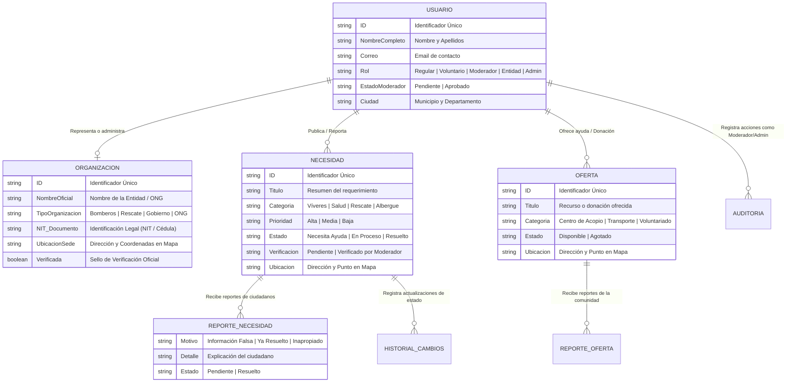
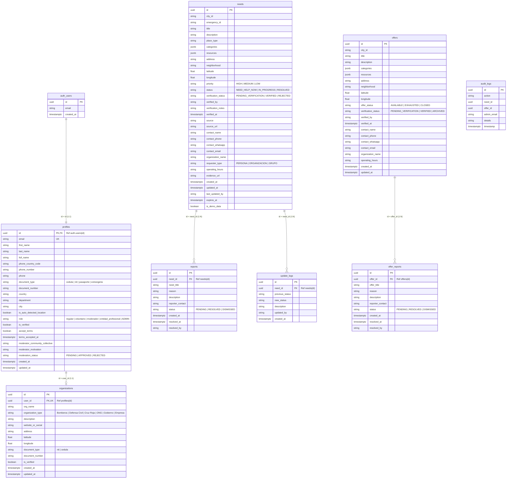
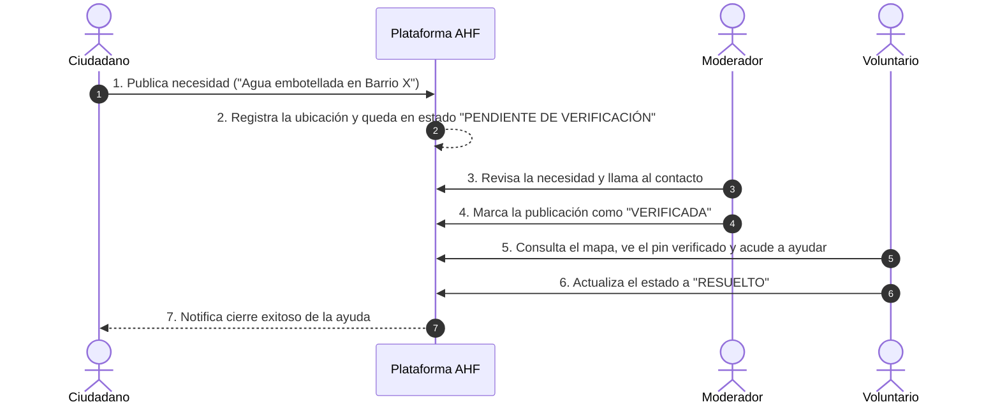

# 🗺️ Arquitectura de Datos y Entidades — Aquí Hace Falta
**Documento Ejecutivo y Funcional para Equipos No Técnicos y Técnicos**

---

> [!NOTE]
> **Resumen Ejecutivo:** Este documento explica en lenguaje sencillo, de negocio y visual cómo está organizada la información dentro de la base de datos de la plataforma **Aquí Hace Falta**. Permite entender cómo se conectan los ciudadanos, los voluntarios, las organizaciones oficiales y los moderadores para coordinar la ayuda en momentos de emergencia o necesidad comunitaria.

---

## 📐 1. Diagrama Conceptual de Relaciones (Visión de Negocio)

El siguiente mapa visual muestra cómo interactúan las distintas entidades desde una perspectiva de procesos de negocio:

---

## 🏛️ 2. Los 5 Módulos Principales de Información

### 👤 Módulo 1: Perfiles de Usuario (`public.profiles`)
Es la libreta principal de datos de cualquier persona registrada en la plataforma.

* **¿Qué almacena?** Nombre completo, documento de identidad (Cédula/NIT), teléfono de contacto, correo electrónico, ubicación (País, Departamento, Ciudad) y aceptación de términos de privacidad.
* **Roles en la Plataforma:**
  * **👤 Usuario Regular:** Ciudadano registrado que puede publicar o solicitar ayuda.
  * **❤️ Voluntario / Donante:** Ciudadano dispuesto a brindar recursos o apoyo en terreno.
  * **⚡ Moderador:** Usuario postulante o aprobado para verificar publicaciones y velar por la veracidad de la información.
  * **🛡️ Entidad / Organización:** Cuenta representante de una institución oficial o comunidad.
  * **👑 Administrador:** Gestor total con acceso a métricas globales y aprobación de moderadores.

---

### 🏢 Módulo 2: Organizaciones e Instituciones (`public.organizations`)
Registra la información institucional de las entidades que coordinan o prestan auxilio.

* **¿Qué almacena?** Nombre oficial de la organización, tipo de entidad (*Bomberos, Defensa Civil, Cruz Roja, ONG, Gobierno Municipal*), NIT o documento legal, dirección física de la sede, ubicación en mapa (Latitud/Longitud) y redes sociales/sitio web.
* **Sello de Verificación:** Permite saber si la entidad ha sido validada oficialmente por los administradores de la plataforma.

---

### 🚨 Módulo 3: Solicitudes de Ayuda / Necesidades (`public.needs`)
Representa cada punto crítico o requerimiento publicado en el mapa.

* **¿Qué almacena?** Título de la necesidad, descripción detallada, categoría (*Alimentos, Medicamentos, Herramientas, Albergue, Agua*), prioridad (*Alta / Urgente, Media, Baja*), dirección exacta, barrio y ubicación en mapa.
* **Estados de la Necesidad:**
  * `NEED_HELP_NOW`: Publicación activa en espera de atención.
  * `IN_PROGRESS`: Voluntarios u organizaciones están atendiendo el punto.
  * `RESOLVED`: Requerimiento atendido con éxito.
* **Verificación de Moderación:** Indica si un moderador oficial ya llamó o verificó en terreno que la necesidad sea real (`PENDING_VERIFICATION` / `VERIFIED`).

---

### 🎁 Módulo 4: Ofertas de Ayuda y Donaciones (`public.offers`)
Almacena los recursos que la ciudadanía o las entidades ponen a disposición.

* **¿Qué almacena?** Título del ofrecimiento, descripción de lo que se donará o prestará, categorías (*Centro de Acopio, Apoyo Médico, Transporte, Víveres*), dirección física y punto geográfico donde se puede recoger o contactar.

---

### 🛡️ Módulo 5: Transparencia, Reportes y Auditoría (`reports`, `update_logs`, `audit_logs`)
Garantiza la seguridad, la veracidad y la auditoría de la plataforma.

* **Reportes Ciudadanos (`reports` / `offer_reports`):** Si un usuario detecta que un mapa muestra información falsa, obsoleta o inapropiada, puede reportarlo para que un moderador lo revise.
* **Historial de Cambios (`update_logs`):** Guarda la bitácora de actualizaciones en las solicitudes (*quién cambió el estado y en qué fecha*).
* **Registro de Auditoría (`audit_logs`):** Bitácora de seguridad que registra cada acción realizada por los moderadores o administradores para evitar abusos y garantizar total transparencia.

---

## 📊 3. Tabla Resumen para Gestión y Negocio

| Entidad en BD | Propósito en el Negocio | ¿Quién la crea / gestiona? | Impacto en la Plataforma |
| :--- | :--- | :--- | :--- |
| **`public.profiles`** | Identificación de usuarios y asignación de permisos de acceso. | Se crea automáticamente al registrarse con correo o Google. | Control de acceso y trazabilidad de contactos. |
| **`public.organizations`** | Ficha institucional de ONGs y cuerpos de socorro. | Representante legal o delegado durante el registro. | Genera confianza y habilita sedes oficiales en el mapa. |
| **`public.needs`** | Mapear emergencias y coordinar recursos donde hace falta. | Ciudadanos, voluntarios o moderadores. | Alimenta el mapa principal de alertas de la ciudad. |
| **`public.offers`** | Mapear puntos de acopio y donaciones disponibles. | Voluntarios, ONGs y empresas solidarias. | Muestra centros de acopio y recursos de ayuda inmediata. |
| **`public.reports`** | Control de calidad e información falsa en necesidades. | Cualquier ciudadano navegando en el portal. | Mantiene limpia la información y evita pánico falso. |
| **`public.offer_reports`** | Control de calidad e información falsa en ofertas. | Cualquier ciudadano navegando en el portal. | Mantiene limpias las ofertas de ayuda. |
| **`public.update_logs`** | Bitácora de cambios de estado en publicaciones. | Sistema y moderadores al actualizar una ayuda. | Historial público de atención a emergencias. |
| **`public.audit_logs`** | Trazabilidad legal y transparencia operativa de admins. | Sistema automático al ejecutar acciones administrativas. | Permite auditar el trabajo de moderación en emergencias. |

---

## 🔍 4. Diagrama Técnico Completo (Modelo de Campos de Base de Datos)

A continuación se presenta el **diagrama físico de datos completo** con el 100% de las tablas y campos que existen actualmente en la base de datos de pruebas/desarrollo de Supabase:

---

## 🔄 5. Flujo de Trabajo: Ciclo de Vida de una Necesidad

---

> [!TIP]
> **Nota de Exportación:** Este documento está listo para ser revisado en pantalla o exportado a formato **PDF** para presentaciones institucionales, comités de emergencia u organizaciones aliadas.
