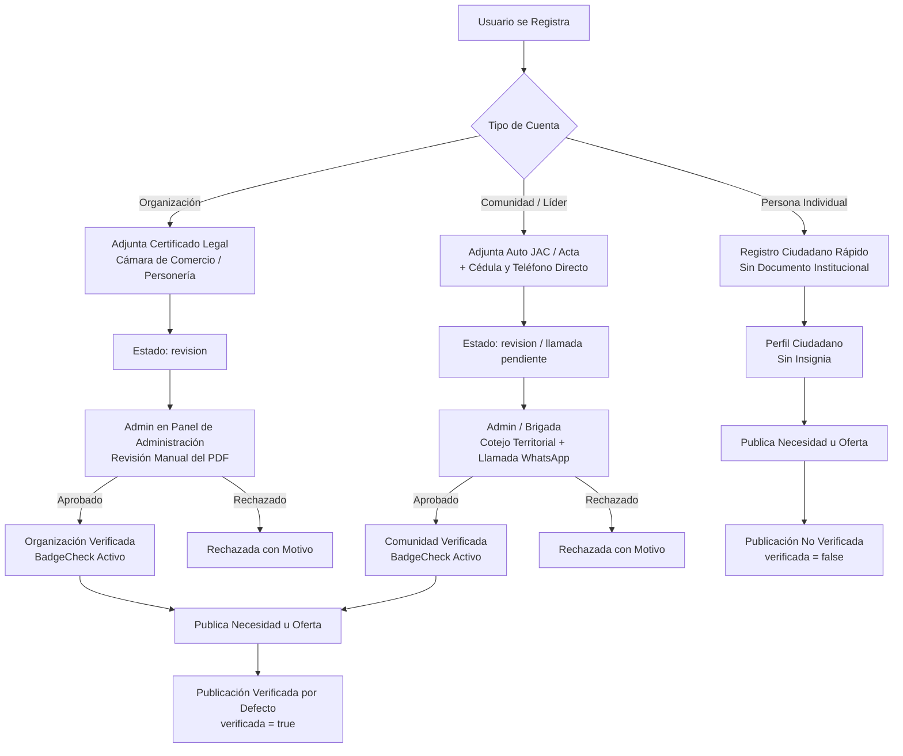

# Especificación de Verificación de Entidades, Líderes y Publicaciones (RaDAR de Ayuda)

Este documento define la arquitectura oficial, reglas de negocio y especificaciones de implementación para el equipo de desarrollo (Backend / Supabase / Frontend) sobre el sistema de **verificación manual de entidades y herencia en publicaciones**.

---

## 1. Fundamentos y Filosofía del Sistema

1. **La confianza es humana y manual:** En situaciones de desastre y ayuda humanitaria, la verificación de una entidad o un líder comunitario no puede delegarse a algoritmos automáticos ni procesos opacos. Un administrador del equipo de RaDAR debe validar la existencia y legitimidad de quien emite o coordina la ayuda.
2. **La entidad avala la publicación (Regla de Oro de Herencia):**
   - Una vez una organización o comunidad es verificada por el equipo de RaDAR, **todas las necesidades y ofertas que publique salen verificadas por defecto (`verificada: true`)**.
   - Si la entidad está en proceso de revisión o sin verificar, sus publicaciones nacen como no verificadas (`verificada: false`).
3. **Tratamiento de Personas Naturales / Individuales:**
   - Los ciudadanos individuales se registran para colaborar o pedir apoyo personal, pero **no representan una institución formal ni un territorio colectivo**.
   - Por diseño, el perfil individual **no tiene insignia institucional de verificación**, y sus publicaciones salen **no verificadas (`verificada: false`)**, presentándose en el Radar como solicitudes o reportes ciudadanos directos.

---

## 2. Tipos de Cuentas y su Proceso de Verificación



### A. Organizaciones (ONGs, Fundaciones, Empresas, Entidades Públicas)
* **Requisitos:** Nombre oficial, NIT, Tipo de entidad, Teléfono público, WhatsApp, Correo y **Certificado de Existencia y Representación Legal** (Cámara de Comercio o personería jurídica en PDF).
* **Ciclo de Estados:**
  - `sin`: Cuenta creada sin documento. Se le notifica en su panel y perfil que puede adjuntarlo para obtener la insignia.
  - `revision`: Documento cargado. Tiempo estimado de respuesta: menos de 2 días hábiles.
  - `verificada`: Aprobado manualmente por un administrador de RaDAR tras corroborar datos contra el registro público.
  - `rechazada`: Si el documento es ilegible, caducado o no corresponde a la entidad.
* **Insignia:** `BadgeCheck` (azul/navy) con el tooltip *«Organización verificada»*.

### B. Comunidades y Líderes Comunitarios (JAC, Cabildos, Veredas, Asentamientos)
* **Contexto territorial:** Muchas juntas vecinales o asentamientos en Colombia no cuentan con personería jurídica mercantil ni Cámara de Comercio. Exigirles NIT mercantil crearía una barrera excluyente para las poblaciones más vulnerables.
* **Requisitos:**
  - Nombre de la comunidad, tipo (JAC, Cabildo/Resguardo, Vereda, Asentamiento, Albergue, Comuna) y Departamento/Municipio.
  - Datos del líder o vocero: Nombre completo, Cédula de ciudadanía / extranjería / PPT, celular directo.
  - **Soporte opcional:** Auto de reconocimiento expedido por la Alcaldía/Secretaría de Gobierno, acta de asamblea comunitaria o aval territorial.
* **Proceso de Verificación:**
  1. El líder registra la comunidad y adjunta su soporte o datos territoriales.
  2. Un administrador de RaDAR o brigadista territorial revisa los datos y **realiza una llamada o mensaje de WhatsApp de corroboración directa**.
  3. Se contrasta la situación comunitaria con fuentes oficiales locales (Defensa Civil, Bomberos, Cruz Roja, enlaces de gestión del riesgo).
  4. Al corroborar, el administrador aprueba la cuenta en el panel.
* **Insignia:** `BadgeCheck` (azul/navy) con el tooltip *«Comunidad verificada»*.

### C. Personas Individuales (Ciudadanos / Voluntarios)
* **Requisitos:** Nombre, cédula de ciudadanía, correo y celular.
* **Condición:** Perfil no institucional.
* **Publicaciones:** Siempre `verificada: false` por defecto.
* **Excepción de moderación ad-hoc:** Si un ciudadano publica una alerta humanitaria crítica, un moderador puede corroborar el caso en terreno o telefónicamente y marcar **únicamente esa publicación puntual** como `verificada: true`, añadiendo una nota de auditoría.

---

## 3. Matriz de Herencia de Verificación

| Perfil de Cuenta | Estado de Verificación de Cuenta | `verificada` en Nueva Publicación | Insignia en Radar / Directorio | Visibilidad con Filtro «Solo verificadas» |
| :--- | :--- | :--- | :--- | :--- |
| **Organización** | `verificada` | `true` (por defecto) | ✅ `BadgeCheck` Visible | ✅ Visible |
| **Organización** | `sin` o `revision` | `false` | ❌ Sin insignia | ❌ Oculta |
| **Comunidad** | `verificada` | `true` (por defecto) | ✅ `BadgeCheck` Visible | ✅ Visible |
| **Comunidad** | `sin` o `revision` | `false` | ❌ Sin insignia | ❌ Oculta |
| **Individual** | `sin` | `false` (por defecto) | ❌ Sin insignia | ❌ Oculta |

---

## 4. Guía de Implementación para Backend y Supabase (Dev Checklist)

Para cuando el equipo de desarrollo implemente la persistencia en Supabase, deben seguir estas directrices:

### 1. Esquema de Base de Datos (PostgreSQL)

```sql
-- 1. Estado de verificación de la entidad
CREATE TYPE verification_status_enum AS ENUM ('UNVERIFIED', 'IN_REVIEW', 'APPROVED', 'REJECTED');

-- 2. Tabla de entidades / organizaciones / comunidades
CREATE TABLE IF NOT EXISTS entities (
    id UUID PRIMARY KEY DEFAULT gen_random_uuid(),
    created_at TIMESTAMPTZ DEFAULT NOW(),
    name TEXT NOT NULL,
    entity_type TEXT NOT NULL, -- 'organizacion' | 'comunidad'
    sub_type TEXT,            -- 'ONG', 'Fundacion', 'JAC', 'Cabildo', etc.
    tax_id TEXT,              -- NIT o identificación fiscal (si aplica)
    department TEXT NOT NULL,
    city TEXT NOT NULL,
    address TEXT,
    contact_phone TEXT NOT NULL,
    contact_email TEXT NOT NULL,
    website TEXT,
    
    -- Verificación
    verification_status verification_status_enum DEFAULT 'UNVERIFIED',
    verification_doc_url TEXT,     -- Enlace al PDF en Supabase Storage
    verification_notes TEXT,       -- Notas internas de la llamada/revisión
    rejection_reason TEXT,         -- Motivo visible si fue rechazada
    verified_by UUID REFERENCES auth.users(id),
    verified_at TIMESTAMPTZ
);

-- 3. Tabla de publicaciones con herencia automática
CREATE TABLE IF NOT EXISTS publications (
    id UUID PRIMARY KEY DEFAULT gen_random_uuid(),
    created_at TIMESTAMPTZ DEFAULT NOW(),
    entity_id UUID REFERENCES entities(id) ON DELETE SET NULL,
    creator_id UUID REFERENCES auth.users(id) NOT NULL,
    type TEXT NOT NULL CHECK (type IN ('necesidad', 'oferta')),
    title TEXT NOT NULL,
    description TEXT,
    is_verified BOOLEAN DEFAULT FALSE,
    lat DOUBLE PRECISION NOT NULL,
    lng DOUBLE PRECISION NOT NULL,
    zone TEXT NOT NULL
);
```

### 2. Trigger de Herencia Automática en PostgreSQL
Para garantizar que nadie pueda manipular el flag `is_verified` desde el cliente:

```sql
CREATE OR REPLACE FUNCTION set_publication_verification_inheritance()
RETURNS TRIGGER AS $$
BEGIN
    -- Si la publicación está ligada a una entidad aprobada, se marca como verificada
    IF NEW.entity_id IS NOT NULL THEN
        SELECT (verification_status = 'APPROVED')
        INTO NEW.is_verified
        FROM entities
        WHERE id = NEW.entity_id;
    ELSE
        -- Publicación individual o sin entidad: siempre arranca no verificada
        NEW.is_verified := FALSE;
    END IF;
    
    RETURN NEW;
END;
$$ LANGUAGE plpgsql SECURITY DEFINER;

CREATE TRIGGER trg_set_publication_verification
BEFORE INSERT ON publications
FOR EACH ROW
EXECUTE FUNCTION set_publication_verification_inheritance();
```

### 3. Seguridad en Storage (Supabase Storage)
- Crear el bucket: `entity-documents`.
- `public: false` (Bucket privado).
- **RLS:**
  - `INSERT`: Solo usuarios autenticados que pertenezcan a la entidad.
  - `SELECT`: Administradores (`role = 'ADMIN'`) y el usuario creador. Ningún usuario externo puede descargar certificados ajenos.

### 4. Bandeja de Aprobación en Panel de Administración
En `AdminPanelPage`:
- Incorporar la pestaña de **Verificación de Entidades**:
  - Listado filtrable por `IN_REVIEW`, `APPROVED`, `REJECTED`.
  - Botón para abrir y previsualizar el PDF (`verification_doc_url`).
  - Botón directo para iniciar chat de WhatsApp con el número del líder/contacto (`https://wa.me/57...`).
  - Botones de acción rápida: **[Aprobar]** y **[Rechazar]** (con modal para ingresar motivo de rechazo).
  - Al aprobar, disparar notificación por correo/WhatsApp a la entidad avisando que ya cuenta con la insignia de verificación.
